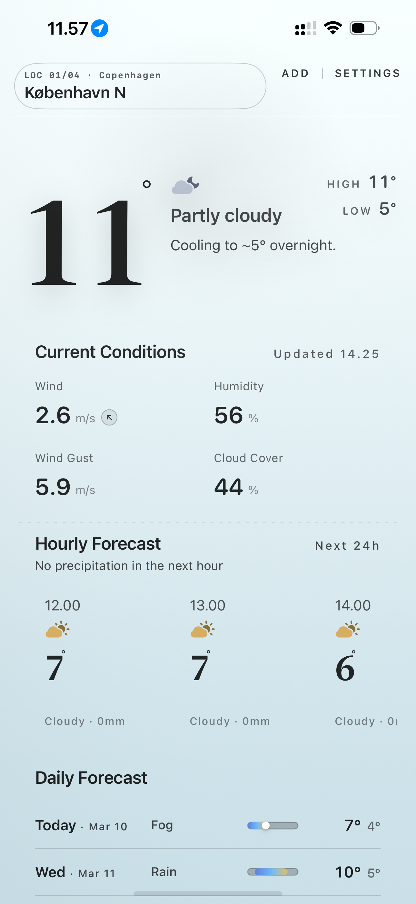
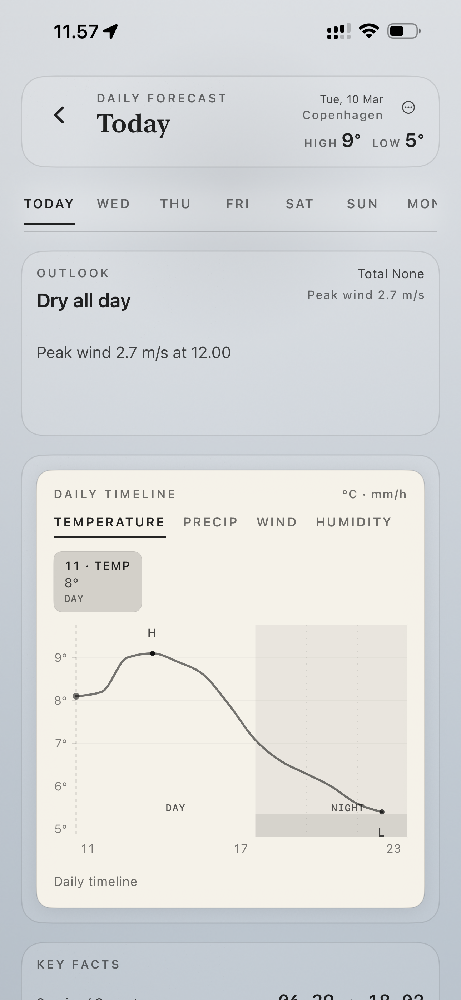
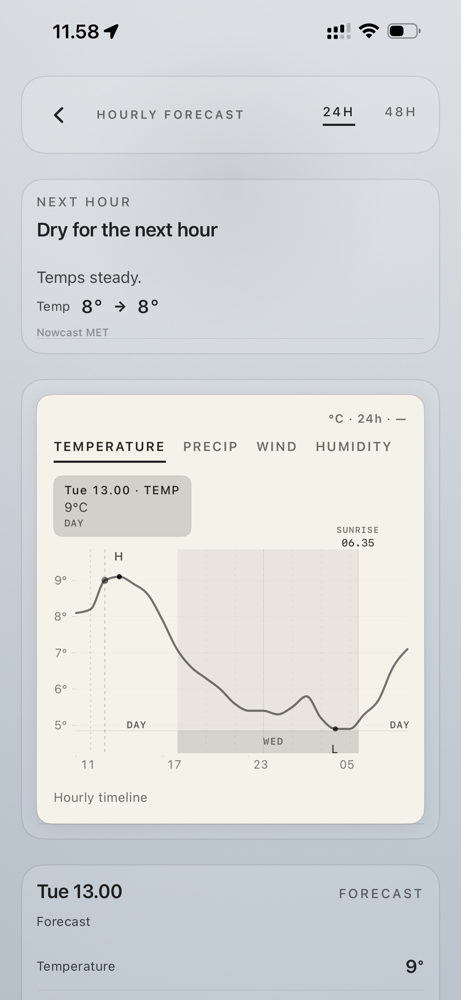
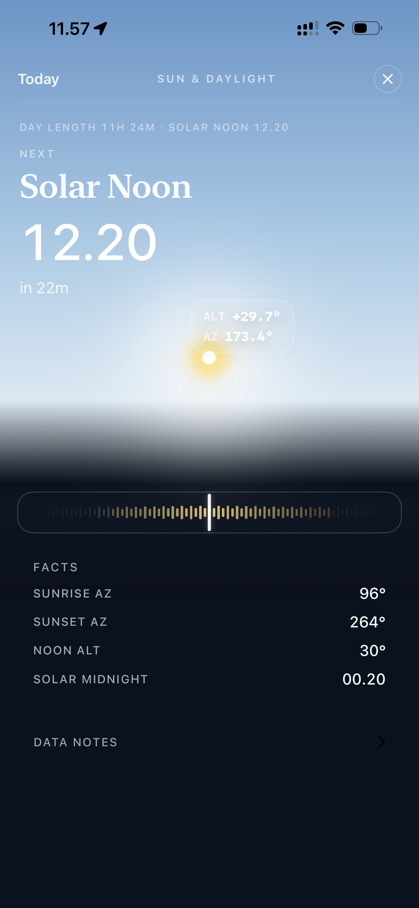
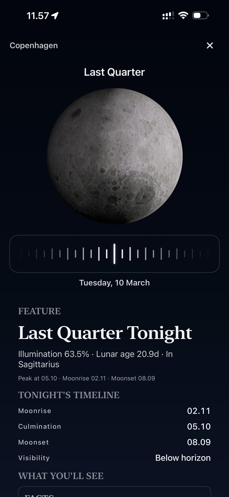

# iOS Portfolio

A collection of iOS apps I've designed and built. Source code is kept private — this repo showcases the UI, architecture, and key features.

---

## Nimbus

A weather app for Denmark, built with real-time data from DMI (Danish Meteorological Institute) and MET Nordic APIs. Designed with an editorial, typography-driven aesthetic.

### Screenshots

  
  
  

  
  

### Features

- **Current conditions** — temperature, wind, humidity, cloud cover with real-time updates
- **Hourly & daily forecasts** — interactive charts for temperature, precipitation, wind, and humidity
- **Precipitation nowcast** — minute-by-minute rain predictions via MET Nordic
- **Sun & daylight explorer** — solar noon countdown, sun position (altitude/azimuth), sunrise/sunset with a sky-gradient visualization and time scrubber
- **Lunar phase explorer** — real-time moon illumination, phase name, moonrise/moonset timeline, constellation tracking with a fisheye date scrubber
- **Radar map** — rain and wind overlays via RainViewer and WX map tiles
- **Weather warnings** — DMI advisory bulletins
- **Multi-location** — manage up to 4 saved locations
- **iOS widget** — glanceable weather on the home screen

### Architecture & Tech

- **Swift / SwiftUI** with MVVM-Coordinator pattern
- **Metal shaders** for real-time sky stage background rendering
- **DMI Open Data API** + **MET Nordic API** for weather data
- **RainViewer API** for radar imagery
- **GCP Cloud Run** backend for tile proxy and data aggregation
- **Terraform** for infrastructure-as-code
- **WidgetKit** for home screen widget

### Status

In active development. Not yet on the App Store.

---

*More projects coming soon.*
