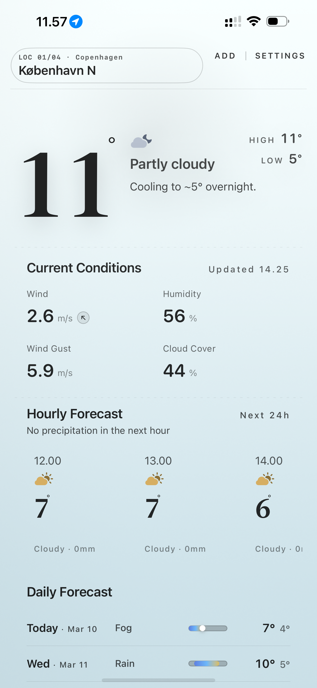
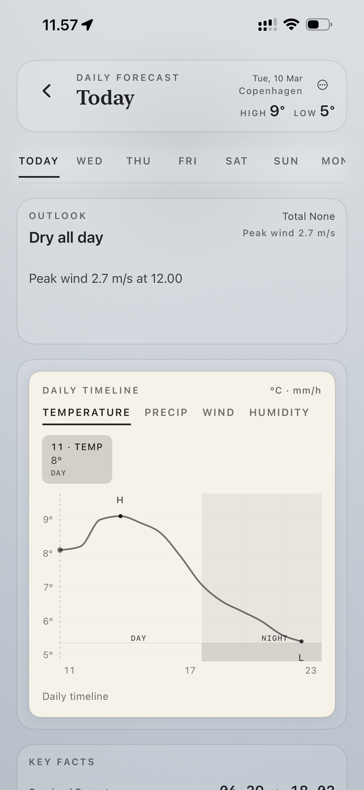
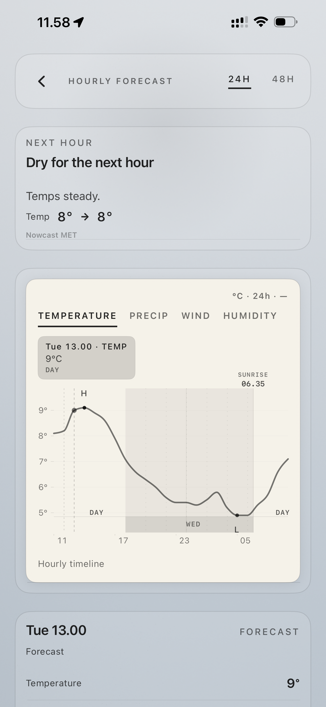
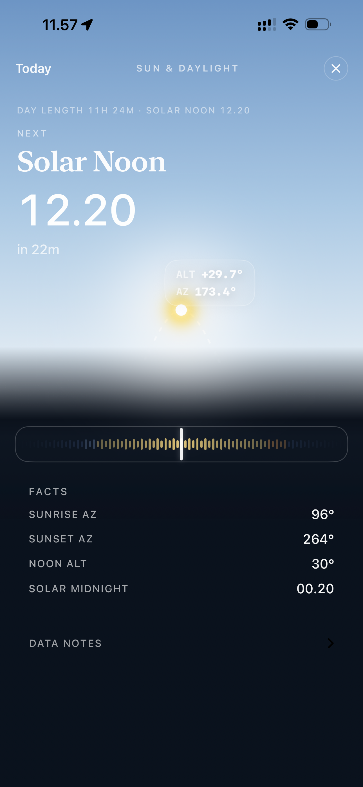
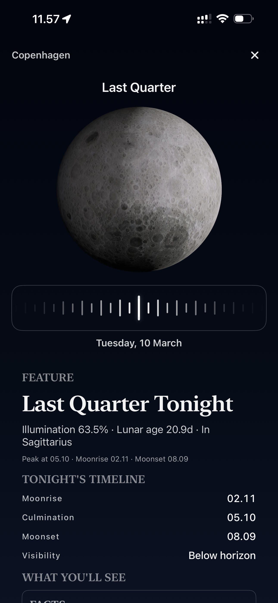

# iOS & Research Portfolio

This repository is a **portfolio index** rather than a full source-code monorepo.

Some featured work is published as standalone repositories, while other projects are presented here through screenshots, architecture notes, and product summaries when the full codebase is private or not ready for public release.

If you want the fastest read of my work, start with:

- [`dtu-thesis-workspace`](https://github.com/isjiajia01/dtu-thesis-workspace) — rolling-horizon delivery optimization thesis workspace
- [`Nu`](https://github.com/isjiajia01/Nu) — native SwiftUI transit app portfolio project
- [`job-ops`](https://github.com/isjiajia01/job-ops) — self-hosted job-search operations system

---

## Nimbus

A weather app for Denmark, built with real-time data from MET Nordic APIs and designed with an editorial, typography-driven aesthetic.

### Screenshots

  
  
  

  
  

### Features

- Current conditions with real-time updates
- Hourly and daily forecast charts
- Minute-level precipitation nowcast
- Sun and daylight explorer
- Lunar phase explorer
- Radar map overlays
- Weather warnings
- Multi-location support
- iOS widget

### Architecture & Tech

- Swift / SwiftUI with MVVM-Coordinator pattern
- Metal shaders for real-time sky rendering
- MET Nordic API and RainViewer API
- GCP Cloud Run backend for tile proxy and data aggregation
- Terraform for infrastructure-as-code
- WidgetKit for home screen widgets

### Status

In active development. Not yet on the App Store.

---

## MSc Thesis — Rolling-Horizon Last-Mile Delivery Optimization

**DTU (Technical University of Denmark), 2026**

Two parallel research tracks tackle the same multi-day last-mile delivery problem from different angles: a learning-augmented compute-allocation line and a rich VRPTW exact/heuristic line.

### Problem

Orders arrive daily with flexible multi-day delivery windows. Each day the system must decide which orders to attempt and how to route vehicles under time-window, capacity, and depot constraints while balancing:

- routing cost
- deadline failures and undelivered orders
- plan instability across rolling re-planning days

### Track 1 — Learning-Augmented Compute Allocation

Focuses on dynamically allocating computational budget across planning days using machine learning.

**Approach**
- Rolling-horizon simulation with carryover of undelivered orders
- Risk-gated allocation based on system stress signals
- ALNS solver for daily VRPTW routing
- Learned offline allocators and online bandit augmentation
- OOD-aware robust fallback variants

**Tech**
- Python
- ALNS
- scikit-learn
- DTU HPC (LSF)

### Track 2 — Rich VRPTW with Exact Methods

Focuses on solving the high-fidelity routing problem with heterogeneous fleet, multi-dimensional capacity, and depot resource constraints.

**Approach**
- Branch-and-price / column-generation ideas
- ALNS + set-partitioning recombination
- Julia/Gurobi-backed exact subproblems
- Depot bucket constraints and stability-aware rolling re-planning

**Tech**
- Python
- Julia
- Gurobi
- OR-Tools
- OSRM
- DTU HPC (LSF)

---

More projects will be added here as they are cleaned up for public presentation.
